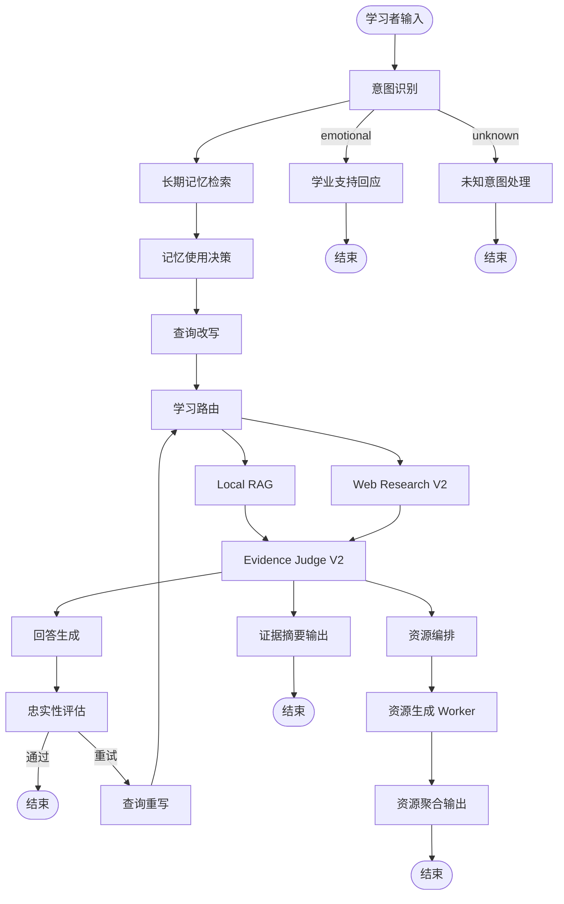

# A3 Study Agent

高校个性化学习资源生成智能体。

<p align="center">
  <a href="README_en.md">English README</a> |
  <a href="docs/architecture/v0.3.0/diagram_design.md">Architecture Diagrams</a> |
  <a href="CHANGELOG.md">Changelog</a>
</p>

<p align="center">
  
  
  <a href="https://github.com/langchain-ai/langgraph">
    
  </a>
  <a href="./LICENSE">
    
  </a>
</p>

## 关于项目

A3 Study Agent 是一个面向高校课程学习场景的多智能体系统。它围绕学习者的问题、目标和资源需求，生成课程答疑、复习文档、思维导图、练习题、代码实操、教学脚本、教学动画和学习计划等个性化学习资源。

系统结合本地课程资料 RAG、BM25、reranker、Tavily Web Research、Evidence Judge V2、DeepSeek strict structured output、SSE 流式输出和 OpenTelemetry 可观测性，支持真实交互链路中的检索、证据判断、生成和诊断。

当前 React 前端主要用于演示复杂 Agent 交互、SSE 流式输出、资源生成和运行轨迹。外部 LangGraph/SSE 节点名仍保留 `web_search`，内部语义已经统一为 Web Research V2。

## 核心能力

- **课程答疑**：基于本地课程材料和 Web Research evidence 的双源证据，生成面向高校学习者的解释、示例和学习建议。
- **个性化资源生成**：统一资源链路支持 `review_doc`、`mindmap`、`quiz`、`code_practice`、`video_script`、`video_animation`、`study_plan` 七类资源。
- **学习计划**：作为统一资源类型生成 Markdown / Word 学习计划文档。
- **学习支持**：以高校学习导师 / 学业支持导师的语气，提供温暖且可执行的建议。
- **稳定结构化输出**：小型结构化节点使用 DeepSeek official strict tool calling；结构化失败通过 re-ask retry 提升恢复能力。
- **可观测性**：通过 A3_TRACE、OpenTelemetry、SSE 节点事件和结构化诊断日志排查真实交互链路。
- **配置驱动**：通过 YAML settings 和 XML prompts 管理运行参数、模型行为和提示词。

## 系统架构



更多图示见 [`docs/architecture/v0.3.0/diagram_design.md`](docs/architecture/v0.3.0/diagram_design.md)。

## 技术栈

| 层级 | 组件 |
| ---- | ---- |
| 前端 | Next.js 16、React、Tailwind CSS、React Flow |
| 后端 API | FastAPI、Uvicorn、SSE |
| 编排 | LangGraph |
| 本地知识库 | ChromaDB、BM25、reranker |
| Web Research | Tavily |
| 结构化输出 | DeepSeek official strict tool calling、Pydantic validation、re-ask retry |
| 证据判断 | Evidence Judge V2 item grader + sufficiency judge |
| 状态快照 | LangGraph Checkpointer，默认 MemorySaver，可选 PostgreSQL |
| 可观测性 | A3_TRACE、OpenTelemetry、Jaeger、SQLite fallback |
| 配置 | YAML settings、XML prompts |

## 快速启动

### Docker Compose

```bash
git clone https://github.com/kyle-1227/A3_study_agent.git
cd A3_study_agent

cp .env.example .env
# 编辑 .env，填入模型、检索和观测配置。

docker compose up -d

# 可选：启用 Jaeger tracing
docker compose --profile observability up -d
```

前端：`http://localhost:3000`
后端 API：`http://localhost:8000`
Jaeger：`http://localhost:16686`

### 本地开发

```bash
python -m venv .venv
.\.venv\Scripts\Activate.ps1

python -m pip install --upgrade pip
pip install -r requirements.txt
pip install -e .

cp .env.example .env
# 编辑 .env，填入 API keys。
```

#### 构建知识库

将 PDF / MD / TXT 课程资料放入以下一个或多个目录：

- `data/big_data`
- `data/computer`
- `data/machine_learning`
- `data/math`
- `data/python`

然后运行：

```bash
python scripts/build_index.py
```

#### 启动服务

后端和前端需要分别打开两个终端运行。

**终端 1：后端**

```bash
uvicorn app:app --reload --port 8000
```

**终端 2：前端**

```bash
cd frontend
npm install
npm run dev
```

注意：`pytest tests/test_security.py -q` 是后端测试命令，不要放在前端启动终端里。

## 项目结构

```text
A3_study_agent/
|-- app.py                         # FastAPI SSE endpoints + lifespan
|-- docker-compose.yml             # Backend + PostgreSQL + Jaeger
|-- config/
|   |-- settings.yaml              # Runtime parameters
|   `-- prompts/                   # XML prompt templates
|-- src/
|   |-- graph/                     # LangGraph nodes and state flow
|   |-- rag/                       # Local retrieval and indexing
|   |-- llm/                       # LLM factory and structured output runtime
|   |-- database/                  # Checkpointer management
|   |-- tracing/                   # OpenTelemetry setup
|   `-- tools/                     # Web research and resource tools
|-- frontend/                      # Next.js UI
|-- data/                          # University course materials
|-- scripts/                       # Indexing and debug scripts
`-- tests/                         # Test suite
```

## 测试

后端测试：

```bash
python -m pytest tests/test_config.py tests/test_app.py tests/test_rag.py tests/test_tracing.py -v
python -m pytest tests/test_security.py -q
```

如果环境允许，可以运行完整后端测试：

```bash
python -m pytest -q
```

前端检查：

```bash
cd frontend
npm run lint
.\node_modules\.bin\tsc.cmd --noEmit
npm run build
```

## License

[MIT](./LICENSE)
