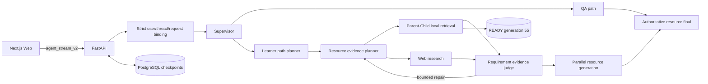

# A3 Study Agent

[English](README_en.md)

A3 Study Agent 是面向高校学习场景的多智能体学习系统。它把严格用户画像、学习路径、课程知识图谱、Parent–Child RAG、网页检索、证据判断与七类学习资源生成统一到可恢复的流式交互中。

## 当前生产状态

| 范围 | 状态 |
| --- | --- |
| Web/API | Next.js + FastAPI，`agent_stream_v2` SSE、状态恢复、事件重放、显式终态 |
| 状态与身份 | PostgreSQL checkpoint 使用健康检查与自动重连连接池；用户、线程、请求、评测 case 全链路严格绑定 |
| 课程图谱 | `KnowledgeGraphV1`，5 个学科，source-backed topic/resource identity |
| 新 RAG | active served graph 固定已密封 `READY` generation `pc_20260715_98336c2_55`，运行 resource-aware PGR 主路径 |
| RAG 发布 | registry primary 为 generation 55，previous / shadow 为空；`activation_enabled=true`、`shadow_enabled=false` |
| 运行身份 | manifest `db579d40d1f4b79882f495277026e8fccfbfb816fbb150998e47753eec470218`；KG artifact `c504e41ef2e481b30b940ac6cb04f661401f7907d1690efeafc1ed14680fa0b5`；Evidence `9dec07d4f097bae80bbf815bd53494e4e8045b15e536d0fc38daa3b4da2e032b` |
| 评测 | Evidence V2-only，V1 明确拒绝；P0 / PG / PR / PGR 真实节点 adapters 是评测变体，6-case 仍是 smoke authoring 而非正式 Gold |
| 质量门 | 后端 `2880 passed / 7 skipped`；前端 36 个文件、`208 passed`，typecheck、lint、production build 通过；Import Linter `3/3` |
| 真实 canary | 同一 Evidence 身份下连续两轮 code-practice 浏览器请求 `production_success=true`；完整六场景与人工内容验收仍未完成 |
| 部署边界 | 当前是 trusted local demo；公共多租户鉴权与租户隔离尚未闭环 |
| 回滚 | 根目录 `chroma_store` 与 Flat 53 在本次发布中必须保留；后续清理需另行审批 |

发布状态已收口：比赛演示 runtime source / integration 为 `ca3960a`，已由 `main` 包含并发布。原始车道提交 SSE `eed2139`、Evidence `4a91f68`、RAG `f53a710` 分别以 `d7f5802`、`cde3e59`、`fa0f2dc` 集成，受控 fallback 治理以 `9cb929c` 集成。运行镜像的 OCI revision 保持其实际代码源 `ca3960a`；后续 docs-only `main` 提交不改变镜像代码身份。以上工程证据仍不代表六场景或人工教育效果验收。

2026-07-18 最终 Docker 复验使用 backend 镜像 `sha256:6f7108ce1af9d5124c1e39a1c241d50eea7b55cb591ef784bc965bfe97247d48` 与 frontend 镜像 `sha256:a650fd112b6469236def418b4ea136d702b46dbd572a3b389e829b4bf547de5e`；frontend、backend、PostgreSQL 均为 `healthy`，`/`、`/onboarding` 与 `/health/ready` 均返回 HTTP 200。

`READY` 只证明 generation 完整性。生产启动还要求 registry primary 与 `PARENT_CHILD_GENERATION_ID` 精确指向同一 generation、shadow 为空且 manifest 身份一致。Evidence 不足时只在同一 PGR 路径内执行初始检索加最多 3 次有界补搜；required evidence 仍须完整，partial 不会被发布为成功。请求失败不会切换 Provider、模型、generation 或 Flat RAG；Flat 53 与根 `chroma_store` 仅作为离线恢复资产保留。

## 核心能力

- 严格 onboarding、用户画像、学习历史与 assessment 绑定。
- 学习路径规划与 source-backed KnowledgeGraph topic 校验。
- 单学科、多学科与多资源请求并行编排。
- Parent–Child Vector + BM25 + RRF + reranker + parent hydration。
- 本地资料和网页证据的严格 requirement / judge / bounded repair 闭环，补搜总任务与 ledger 同样受预算约束。
- P0（无规划/无修复）、PG（有规划/无修复）、PR（无规划/有修复）、PGR（有规划/有修复）evaluation adapters；它们不是四条生产流量路径。
- study plan、mind map、quiz、review document、code practice、video script、video animation 七类资源。
- code-practice 生成使用流式模型配置，严格 reviewer 使用独立 non-streaming 配置并保留结构化与业务校验。
- SSE `EvidenceProgress`、Last-Event-ID 重放、thread status 恢复和持久化下载。

## 架构



Provider、model、base URL、API key 环境变量名和 retry 策略来自严格配置；业务节点不得硬编码，也不会在失败时静默切换 Provider、模型或旧 RAG。

## Docker 一键部署

要求：Docker Desktop / Docker Engine、Compose v2，以及另行提供且具备授权的课程资料和已密封 Parent–Child index。干净 Git checkout 并不自包含这些资产。

```powershell
if (-not (Test-Path -LiteralPath '.env')) {
  Copy-Item -LiteralPath '.env.example' -Destination '.env'
}
# 编辑 .env：填入密钥、强数据库密码、数据路径和 index 路径。
$env:A3_ENV_FILE = (Resolve-Path '.env').Path

docker compose --project-name a3_study_agent --env-file $env:A3_ENV_FILE config --quiet
docker compose --project-name a3_study_agent --env-file $env:A3_ENV_FILE up --detach --build --wait
docker compose --project-name a3_study_agent --env-file $env:A3_ENV_FILE ps
```

关键必填项：

- shell 级 `A3_ENV_FILE`（被忽略 env 文件的绝对路径）
- `DEEPSEEK_API_KEY`
- `RAG_EMBEDDING_API_KEY`
- `RAG_RERANKER_API_KEY`
- `TAVILY_API_KEY`
- `POSTGRES_PASSWORD`
- `NEXT_PUBLIC_API_URL`
- `COURSE_DATA_HOST_PATH`
- `PARENT_CHILD_INDEX_HOST_PATH`
- `PARENT_CHILD_GENERATION_ID`

Compose 将 backend、frontend 和 PostgreSQL 分开监管；Parent–Child sealed index 只读挂载，`.runtime_chroma` 使用独立可写卷，生成文件保存在 `artifacts` volume。镜像包含 Chromium 与 ffmpeg，支持真实 video animation。后端 checkpointer 使用严格配置的 `AsyncConnectionPool`；连接失效时由池健康检查并重连，不会切换到 `MemorySaver`。
课程资料继续只读挂载；画像、记忆等可变 SQLite 状态写入独立的 `app_state:/app/.runtime_state` 持久卷。启动时仅在新目标不存在时原子迁移旧 `/app/data/profile.db` 与 `memory.db`，绝不覆盖新状态；schema 初始化失败会阻断启动。


启动后检查：

```powershell
Invoke-WebRequest http://localhost:8000/health/live -UseBasicParsing
Invoke-WebRequest http://localhost:8000/health/ready -UseBasicParsing
Invoke-WebRequest http://localhost:8000/graph/manifest -UseBasicParsing
Invoke-WebRequest http://localhost:8000/subjects -UseBasicParsing
Invoke-WebRequest http://localhost:3000 -UseBasicParsing
```

`/health/ready` 必须返回 `health_ready_v3`、`status=ready`、`checkpointer_type=postgres`、`deployment_mode=active`、`rollout_activation_enabled=true` 与 `rollout_shadow_enabled=false`，并携带 graph、KnowledgeGraph、generation manifest 与 evidence orchestration 身份。任何缺失或不匹配都视为部署失败。readiness 恢复只证明新借出的 PostgreSQL 连接可用；数据库单独重启后仍须在 backend/frontend 容器 ID 不变的条件下复核历史 thread、SSE、Context 与 artifact。
生产级受控恢复不得降低结果质量：Evidence `4a91f68` 仅以同一 Provider/模型对失败的 resource+subject partition 做有界 reask，仍执行完整结构化与业务校验，且 reask 本身不判断 blocked；RAG `f53a710` 仅在同一 rerank endpoint 对批次做有界拆分，并要求全部候选都有完整 score，禁止 RRF-only 与 partial scores；SSE `eed2139` 只在 transport 或 HTTP 410 时读取一次同用户/线程/请求的权威终态，不重新提交 Graph。pending、legacy、sequence gap、身份漂移和合同错误都显式失败。


完整部署、PostgreSQL-only restart/replay、六场景 Playwright canary 操作规程与恢复边界见 [生产部署运行手册](docs/runbooks/production_deployment.md)。操作规程本身不代表真实 canary 已通过。

## 本地开发

Python 3.11+ 与 Node.js 20.12+：

```powershell
python -m venv .venv
.\.venv\Scripts\Activate.ps1
pip install -e ".[dev,quality]"
if (-not (Test-Path -LiteralPath '.env')) {
  Copy-Item -LiteralPath '.env.example' -Destination '.env'
}
# 编辑 .env；本地严格启动同样需要 PostgreSQL、密钥、课程资料与 sealed index。

Push-Location frontend
npm ci
Pop-Location

python -m scripts.run_backend --no-reload --host 0.0.0.0 --port 8000
```

另开终端：

```powershell
Push-Location frontend
npm run dev
```

Parent–Child 构建、Gold、诊断与 registry 操作必须使用显式参数，详见 [Parent–Child RAG 运行手册](docs/runbooks/parent_child_rag_local_build.md)。

## 质量门

集成后只跑一次完整门禁；开发期间优先使用相关聚焦测试。

```powershell
python -m compileall -q src tests app.py
ruff check .
ruff format --check .
python -m pytest -q
lint-imports --config .importlinter
bandit -r src -x tests

Push-Location frontend
npm run test
npm run typecheck
npm run lint
npm run build
Pop-Location
```

当前完整后端结果是 `2880 passed / 7 skipped`；SSE `eed2139` 的完整前端结果是 36 个测试文件、`208 passed`，typecheck、lint 和显式 `NEXT_PUBLIC_API_URL=http://127.0.0.1:8000` 的 production build 通过；Import Linter `3/3`。`ca3960a` 的最终前后端镜像与三容器健康、HTTP/readiness 复验已通过。Semgrep 与 Gitleaks 当前未安装、未运行，不能写成通过；两轮 code-practice 真实浏览器 canary 只证明其历史 runtime，不替代尚未完成的六场景 canary 或人工内容验收。

## 比赛文档

- [比赛最终文档索引](docs/competition/README.md)
- [系统开发说明书](docs/competition/system_development.md)
- [测试说明书](docs/competition/test_report.md)
- [部署说明书](docs/competition/deployment_guide.md)
- [第三方软件与 AI 工具说明](docs/competition/third_party_notices.md)

## 项目结构

```text
app.py                     FastAPI、SSE、status/replay 与 artifact API
frontend/                  Next.js Web 客户端
src/graph/                 served graph、证据闭环与资源节点
src/learning_guidance/     KnowledgeGraph、画像/历史与路径合同
src/rag/parent_child/      generation、检索、hydration 与 runtime
src/evaluation/            P0/PG/PR/PGR rollout evaluation
config/                    严格运行配置与 prompt
scripts/                   构建、诊断、评测与部署工具
tests/                     后端、合同、安全和集成测试
docs/runbooks/             生产与 RAG 运维手册
```

## 重要限制

- 不得把 6-case smoke 数据集描述为正式 Gold 或人工评审通过。
- 不得删除旧 RAG、Flat 53、generation 55、registry、成功报告或 Gold checkpoint。
- 不得在报告、trace、截图或命令行中输出 API key、Authorization、完整 DB URI 或 Provider body。
- 不得把 Candidate 失败转换成旧 RAG 的伪成功；回滚只能显式执行。
- 当前部署只面向可信本地演示环境；在公共多租户鉴权、租户隔离和滥用防护闭环前，不得公开暴露服务。

## License

项目代码见 [MIT License](LICENSE)。直接依赖来源与许可证、外部服务边界及需要人工分发审查的项目见[第三方软件与 AI 工具说明](docs/competition/third_party_notices.md)。
