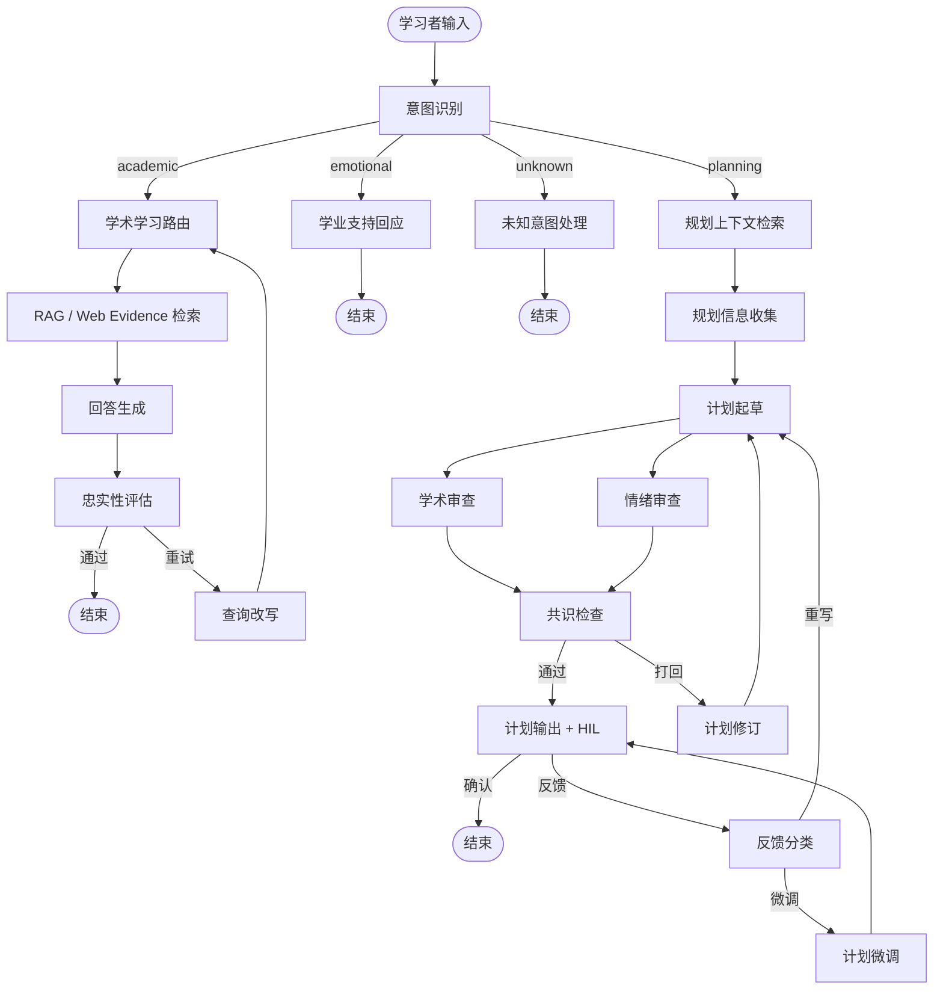

# A3 Study Agent

高校个性化学习资源生成智能体。

<p align="center">
  <a href="README_en.md">English README</a> |
  <a href="docs/architecture/v0.3.0/diagram_design.md">Architecture Diagrams</a> |
  <a href="CHANGELOG.md">Changelog</a>
</p>

<p align="center">
  
  
  <a href="https://github.com/langchain-ai/langgraph">
    
  </a>
  <a href="./LICENSE">
    
  </a>
</p>

## 关于项目

A3 Study Agent 是一个面向高校课程学习场景的多智能体学习资源生成系统。它基于 **LangGraph**、**FastAPI** 和 **Next.js** 构建，围绕学习者的课程问题、学习目标和资源需求，生成课程答疑、分层练习、思维导图和学习规划等个性化学习资源。

系统结合本地课程资料 RAG、BM25、Reranker、Tavily Web Search、结构化 LLM 输出和 OpenTelemetry 可观测性，支持真实交互链路中的检索、证据裁决、生成和诊断。

> 当前 React 前端主要用于演示复杂 Agent 交互、SSE 流式输出、资源生成和运行轨迹。后续规划模块会继续扩展，但第一阶段文档不再覆盖专项规划页面。

## 核心能力

- **课程答疑**：基于本地课程资料和 Web evidence 的双源证据融合，生成面向高校学习者的解释与示例。
- **个性化学习资源生成**：生成分层练习题、思维导图、项目案例和学习材料摘要。
- **学习规划**：通过多 Agent 起草、审查和人工反馈，支持阶段化学习安排。
- **情绪与学业支持**：以高校学习导师 / 学业支持导师的语气，提供温暖且可执行的建议。
- **可观测性**：通过 A3_TRACE、OpenTelemetry、SSE 节点事件和结构化诊断日志排查真实交互链路。
- **配置驱动**：通过 YAML 配置和 XML prompt 管理运行参数与模型行为。

## 系统架构



详细架构图见 [`docs/architecture/v0.3.0/diagram_design.md`](docs/architecture/v0.3.0/diagram_design.md)。

## 技术栈

| 层级 | 组件 |
| ---- | ---- |
| 前端 | Next.js 16、React、Tailwind CSS、React Flow |
| 后端 API | FastAPI、Uvicorn、SSE |
| 编排 | LangGraph |
| 本地知识库 | ChromaDB、BM25、Reranker |
| Web Search | Tavily |
| 状态快照 | LangGraph Checkpointer，默认 MemorySaver，可选 PostgreSQL |
| 可观测性 | A3_TRACE、OpenTelemetry、Jaeger、SQLite fallback |
| 配置 | YAML settings、XML prompts |

## 快速启动

### Docker Compose

```bash
git clone https://github.com/kyle-1227/A3_study_agent.git
cd A3_study_agent

cp .env.example .env
# 编辑 .env，填入所需模型、搜索和观测配置

docker compose up -d

# 可选：启用 Jaeger tracing
docker compose --profile observability up -d
```

前端：`http://localhost:3000`
后端 API：`http://localhost:8000`
Jaeger：`http://localhost:16686`

### 本地开发

```bash
conda create -n a3_study_agent python=3.11 -y
conda activate a3_study_agent

pip install -e ".[dev]"

cp .env.example .env
# 编辑 .env，填入 API keys
```

#### 构建知识库

将 PDF / MD / TXT 课程资料放入以下目录中的一个或多个：

- `data/big_data`
- `data/computer`
- `data/machine_learning`
- `data/math`
- `data/python`

然后运行：

```bash
python scripts/build_index.py
```

#### 启动服务

```bash
# 终端 1：后端
uvicorn app:app --reload --port 8000

# 终端 2：前端
cd frontend
npm install
npm run dev
```

## 项目结构

```text
A3_study_agent/
├── app.py                         # FastAPI SSE endpoints + lifespan
├── docker-compose.yml             # Backend + PostgreSQL + Jaeger
├── config/
│   ├── settings.yaml              # Runtime parameters
│   └── prompts/                   # XML prompt templates
├── src/
│   ├── graph/                     # LangGraph nodes and state flow
│   ├── rag/                       # Local retrieval and indexing
│   ├── llm/                       # LLM factory and structured output runtime
│   ├── database/                  # Checkpointer management
│   ├── tracing/                   # OpenTelemetry setup
│   └── tools/                     # Web search and resource tools
├── frontend/                      # Next.js UI
├── data/                          # University course materials
├── scripts/                       # Indexing and debug scripts
└── tests/                         # Test suite
```

## 测试

```bash
python -m pytest tests/test_config.py tests/test_app.py tests/test_rag.py tests/test_tracing.py -v

# 环境允许时
python -m pytest -q
cd frontend && npm run build
```

## License

[MIT](./LICENSE)
