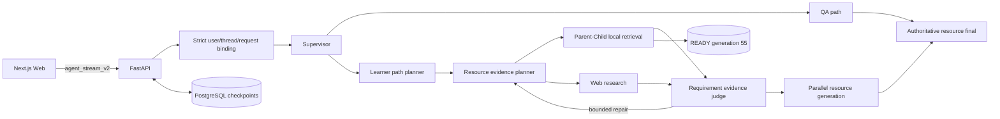

# A3 Study Agent

[English](README_en.md)

A3 Study Agent 是面向高校学习场景的多智能体学习系统。它把严格用户画像、学习路径、课程知识图谱、Parent–Child RAG、网页检索、证据判断与七类学习资源生成统一到可恢复的流式交互中。

## 当前生产收口状态

| 范围 | 状态 |
| --- | --- |
| Web/API | Next.js + FastAPI，`agent_stream_v2` SSE、状态恢复、事件重放、显式终态 |
| 状态与身份 | PostgreSQL checkpoint；用户、线程、请求、评测 case 全链路严格绑定 |
| 课程图谱 | `KnowledgeGraphV1`，5 个学科，source-backed topic/resource identity |
| 新 RAG | 当前发布配置固定已密封 `READY` generation `pc_20260715_98336c2_55` 与 resource-aware PGR 主路径；实际服务状态以最终 runtime 核验为准 |
| RAG 发布 | registry primary 配置为 generation 55，previous / shadow 为空；activation、manifest 与 served identity 必须由最终 `health_ready_v3` / manifest 核验 |
| 评测 | Evidence V2-only，V1 明确拒绝；P0 / PG / PR / PGR 真实节点 adapters 是评测变体，6-case 仍是 smoke authoring 而非正式 Gold |
| 质量门 | 最近一次完整后端门禁为 `2871 passed / 7 skipped`；Semgrep 与 Gitleaks 当前未安装、未运行 |
| 真实 canary | active PGR 网页 canary 正在复测，当前不得声明最终验收通过 |
| 部署边界 | 当前是 trusted local demo；公共多租户鉴权与租户隔离尚未闭环 |
| 回滚 | 根目录 `chroma_store` 与 Flat 53 在本次发布中必须保留；后续清理需另行审批 |

`READY` 只证明 generation 完整性。生产启动还要求 registry primary 与 `PARENT_CHILD_GENERATION_ID` 精确指向同一 generation、shadow 为空且 manifest 身份一致。请求失败时直接失败，不会切换到 Flat RAG；Flat 53 与根 `chroma_store` 仅作为离线恢复资产保留。

## 核心能力

- 严格 onboarding、用户画像、学习历史与 assessment 绑定。
- 学习路径规划与 source-backed KnowledgeGraph topic 校验。
- 单学科、多学科与多资源请求并行编排。
- Parent–Child Vector + BM25 + RRF + reranker + parent hydration。
- 本地资料和网页证据的严格 requirement / judge / bounded repair 闭环。
- P0（无规划/无修复）、PG（有规划/无修复）、PR（无规划/有修复）、PGR（有规划/有修复）evaluation adapters；它们不是四条生产流量路径。
- study plan、mind map、quiz、review document、code practice、video script、video animation 七类资源。
- SSE `EvidenceProgress`、Last-Event-ID 重放、thread status 恢复和持久化下载。

## 架构



Provider、model、base URL、API key 环境变量名和 retry 策略来自严格配置；业务节点不得硬编码，也不会在失败时静默切换 Provider、模型或旧 RAG。

## Docker 一键部署

要求：Docker Desktop / Docker Engine、Compose v2，以及本地课程资料和已密封 Parent–Child index。

```powershell
if (-not (Test-Path -LiteralPath '.env')) {
  Copy-Item -LiteralPath '.env.example' -Destination '.env'
}
# 编辑 .env：填入密钥、强数据库密码、数据路径和 index 路径。
$env:A3_ENV_FILE = (Resolve-Path '.env').Path

docker compose --project-name a3_study_agent --env-file $env:A3_ENV_FILE config --quiet
docker compose --project-name a3_study_agent --env-file $env:A3_ENV_FILE up --detach --build --wait
docker compose --project-name a3_study_agent --env-file $env:A3_ENV_FILE ps
```

关键必填项：

- shell 级 `A3_ENV_FILE`（被忽略 env 文件的绝对路径）
- `DEEPSEEK_API_KEY`
- `RAG_EMBEDDING_API_KEY`
- `RAG_RERANKER_API_KEY`
- `TAVILY_API_KEY`
- `POSTGRES_PASSWORD`
- `NEXT_PUBLIC_API_URL`
- `COURSE_DATA_HOST_PATH`
- `PARENT_CHILD_INDEX_HOST_PATH`
- `PARENT_CHILD_GENERATION_ID`

Compose 将 backend、frontend 和 PostgreSQL 分开监管；Parent–Child sealed index 只读挂载，`.runtime_chroma` 使用独立可写卷，生成文件保存在 `artifacts` volume。镜像包含 Chromium 与 ffmpeg，支持真实 video animation。

启动后检查：

```powershell
Invoke-WebRequest http://localhost:8000/health/live -UseBasicParsing
Invoke-WebRequest http://localhost:8000/health/ready -UseBasicParsing
Invoke-WebRequest http://localhost:8000/graph/manifest -UseBasicParsing
Invoke-WebRequest http://localhost:8000/subjects -UseBasicParsing
Invoke-WebRequest http://localhost:3000 -UseBasicParsing
```

`/health/ready` 必须返回 `health_ready_v3`、`status=ready`、`checkpointer_type=postgres`、`deployment_mode=active`、`rollout_activation_enabled=true` 与 `rollout_shadow_enabled=false`，并携带 graph、KnowledgeGraph、generation manifest 与 evidence orchestration 身份。任何缺失或不匹配都视为部署失败。

完整部署、PostgreSQL restart/replay、六场景 Playwright canary 与回滚边界见 [生产部署运行手册](docs/runbooks/production_deployment.md)。

## 本地开发

Python 3.11+ 与 Node.js 20.12+：

```powershell
python -m venv .venv
.\.venv\Scripts\Activate.ps1
pip install -e ".[dev,quality]"
if (-not (Test-Path -LiteralPath '.env')) {
  Copy-Item -LiteralPath '.env.example' -Destination '.env'
}
# 编辑 .env；本地严格启动同样需要 PostgreSQL、密钥、课程资料与 sealed index。

Push-Location frontend
npm ci
Pop-Location

python -m scripts.run_backend --no-reload --host 0.0.0.0 --port 8000
```

另开终端：

```powershell
Push-Location frontend
npm run dev
```

Parent–Child 构建、Gold、诊断与 registry 操作必须使用显式参数，详见 [Parent–Child RAG 运行手册](docs/runbooks/parent_child_rag_local_build.md)。

## 质量门

集成后只跑一次完整门禁；开发期间优先使用相关聚焦测试。

```powershell
python -m compileall -q src tests app.py
ruff check .
ruff format --check .
python -m pytest -q
lint-imports --config .importlinter
bandit -r src -x tests

Push-Location frontend
npm run test
npm run typecheck
npm run lint
npm run build
Pop-Location
```

当前记录的完整后端结果是 `2871 passed / 7 skipped`。Semgrep 与 Gitleaks 当前未安装、未运行，不能写成通过；真实网页 canary 仍在复测，也不能由单元测试结果替代。

## 项目结构

```text
app.py                     FastAPI、SSE、status/replay 与 artifact API
frontend/                  Next.js Web 客户端
src/graph/                 served graph、证据闭环与资源节点
src/learning_guidance/     KnowledgeGraph、画像/历史与路径合同
src/rag/parent_child/      generation、检索、hydration 与 runtime
src/evaluation/            P0/PG/PR/PGR rollout evaluation
config/                    严格运行配置与 prompt
scripts/                   构建、诊断、评测与部署工具
tests/                     后端、合同、安全和集成测试
docs/runbooks/             生产与 RAG 运维手册
```

## 重要限制

- 不得把 6-case smoke 数据集描述为正式 Gold 或人工评审通过。
- 不得删除旧 RAG、Flat 53、generation 55、registry、成功报告或 Gold checkpoint。
- 不得在报告、trace、截图或命令行中输出 API key、Authorization、完整 DB URI 或 Provider body。
- 不得把 Candidate 失败转换成旧 RAG 的伪成功；回滚只能显式执行。
- 当前部署只面向可信本地演示环境；在公共多租户鉴权、租户隔离和滥用防护闭环前，不得公开暴露服务。

## License

See [LICENSE](LICENSE).
