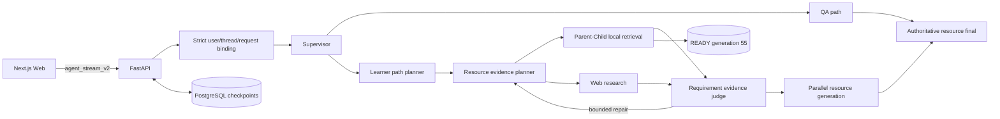

# A3 Study Agent

[中文](README.md)

A3 Study Agent is a multi-agent learning system for university study. It combines strict learner profiles, learning paths, a curated course knowledge graph, Parent-Child RAG, web research, evidence judgement, and seven resource generators in a recoverable streaming experience.

## Current production state

| Area | State |
| --- | --- |
| Web/API | Next.js + FastAPI with `agent_stream_v2` SSE, status recovery, replay, and explicit terminal events |
| State and identity | PostgreSQL checkpoints; strict user, thread, request, dataset, and case binding |
| Course graph | `KnowledgeGraphV1`, five subjects, source-backed topic/resource identity |
| New RAG | the active served graph pins sealed `READY` generation `pc_20260715_98336c2_55` and runs the resource-aware PGR path |
| RAG deployment | registry primary is generation 55; previous / shadow are unset; `activation_enabled=true` and `shadow_enabled=false` |
| Runtime identity | manifest `db579d40d1f4b79882f495277026e8fccfbfb816fbb150998e47753eec470218`; KG artifact `c504e41ef2e481b30b940ac6cb04f661401f7907d1690efeafc1ed14680fa0b5`; Evidence `6274c8ac2b0e70828d7e5f64f72ed8f2b9ab36ae8683adcf0b274d60df277b01` |
| Evaluation | Evidence is V2-only and V1 is rejected; P0 / PG / PR / PGR real-node adapters are evaluation variants, while the six-case dataset remains smoke authoring rather than formal Gold |
| Quality gate | backend `2880 passed / 7 skipped`; frontend 36 files and `187 passed`, with typecheck, lint, and production build passing; Import Linter `3/3` |
| Live canary | two consecutive code-practice browser requests under the same Evidence identity returned `production_success=true`; the full six-scenario and human-content acceptance remain incomplete |
| Deployment boundary | this is a trusted local demo; public multi-tenant authentication and tenant isolation are not closed |
| Rollback | repository-root `chroma_store` and Flat 53 must remain in this release; later cleanup requires separate approval |

`READY` proves artifact integrity only. Production startup additionally requires the registry primary and `PARENT_CHILD_GENERATION_ID` to name the same generation, an empty shadow pointer, and the exact manifest identity. Evidence gaps may use the initial retrieval plus at most three bounded supplement rounds within the same PGR path; required evidence must still be complete and partial results are never published as success. Errors never switch Provider, model, generation, or Flat RAG. Flat 53 and the root `chroma_store` remain offline recovery assets, not request-time fallbacks.

## Capabilities

- Strict onboarding, learner-profile, learning-history, and assessment binding.
- Learning-path planning validated against source-backed KnowledgeGraph topics.
- Parallel single-subject, multi-subject, and multi-resource orchestration.
- Parent-Child Vector + BM25 + RRF + reranker + parent hydration.
- Strict local/web requirement, judgement, and bounded-repair evidence loops with bounded search-task and ledger budgets.
- P0 (no planning/no repair), PG (planning/no repair), PR (no planning/repair), and PGR (planning/repair) evaluation adapters; they are not four served traffic variants.
- Study plan, mind map, quiz, review document, code practice, video script, and video animation resources.
- Streaming code-practice generation with an independently configured non-streaming strict reviewer; structured and business validation remain mandatory.
- SSE `EvidenceProgress`, Last-Event-ID replay, thread-status recovery, and persistent downloads.

## Architecture



Provider, model, base URL, API-key environment name, and retry policy come from strict configuration. Business nodes do not hardcode them and do not silently switch Provider, model, or RAG path after failure.

## One-command Docker deployment

Requirements: Docker Desktop / Docker Engine, Compose v2, separately supplied licensed course data, and the sealed Parent-Child index. A clean Git checkout is not self-contained.

```powershell
if (-not (Test-Path -LiteralPath '.env')) {
  Copy-Item -LiteralPath '.env.example' -Destination '.env'
}
# Populate secrets, a strong DB password, and the two host asset paths.
$env:A3_ENV_FILE = (Resolve-Path '.env').Path

docker compose --project-name a3_study_agent --env-file $env:A3_ENV_FILE config --quiet
docker compose --project-name a3_study_agent --env-file $env:A3_ENV_FILE up --detach --build --wait
docker compose --project-name a3_study_agent --env-file $env:A3_ENV_FILE ps
```

Required settings:

- shell selector `A3_ENV_FILE` (absolute path to the ignored env file)
- `DEEPSEEK_API_KEY`
- `RAG_EMBEDDING_API_KEY`
- `RAG_RERANKER_API_KEY`
- `TAVILY_API_KEY`
- `POSTGRES_PASSWORD`
- `NEXT_PUBLIC_API_URL`
- `COURSE_DATA_HOST_PATH`
- `PARENT_CHILD_INDEX_HOST_PATH`
- `PARENT_CHILD_GENERATION_ID`

Compose supervises backend, frontend, and PostgreSQL separately. The sealed Parent-Child index is mounted read-only, `.runtime_chroma` has a dedicated writable volume, and generated downloads use the persistent `artifacts` volume. Chromium and ffmpeg are included for real video-animation output.

Verify startup:

```powershell
Invoke-WebRequest http://localhost:8000/health/live -UseBasicParsing
Invoke-WebRequest http://localhost:8000/health/ready -UseBasicParsing
Invoke-WebRequest http://localhost:8000/graph/manifest -UseBasicParsing
Invoke-WebRequest http://localhost:8000/subjects -UseBasicParsing
Invoke-WebRequest http://localhost:3000 -UseBasicParsing
```

`/health/ready` must return `health_ready_v3`, `status=ready`, `checkpointer_type=postgres`, `deployment_mode=active`, `rollout_activation_enabled=true`, and `rollout_shadow_enabled=false`, together with the graph, KnowledgeGraph, generation-manifest, and evidence-orchestration identities. Any missing or mismatched identity is a failed deployment.

See the [production deployment runbook](docs/runbooks/production_deployment.md) for PostgreSQL restart/replay, the six-scenario Playwright canary procedure, and recovery boundaries. A documented procedure is not evidence that a real canary passed.

## Local development

Python 3.11+ and Node.js 20.12+:

```powershell
python -m venv .venv
.\.venv\Scripts\Activate.ps1
pip install -e ".[dev,quality]"
if (-not (Test-Path -LiteralPath '.env')) {
  Copy-Item -LiteralPath '.env.example' -Destination '.env'
}
# Populate .env; strict local startup also requires PostgreSQL, secrets,
# course data, and the sealed index.

Push-Location frontend
npm ci
Pop-Location

python -m scripts.run_backend --no-reload --host 0.0.0.0 --port 8000
```

In another terminal:

```powershell
Push-Location frontend
npm run dev
```

Parent-Child builds, Gold authoring, diagnostics, and registry operations require explicit arguments. Follow the [Parent-Child RAG runbook](docs/runbooks/parent_child_rag_local_build.md).

## Quality gates

Run the complete matrix once after integration; use focused related tests while developing.

```powershell
python -m compileall -q src tests app.py
ruff check .
ruff format --check .
python -m pytest -q
lint-imports --config .importlinter
bandit -r src -x tests

Push-Location frontend
npm run test
npm run typecheck
npm run lint
npm run build
Pop-Location
```

The complete backend result is `2880 passed / 7 skipped`. Frontend tests passed in 36 files with `187 passed`; typecheck, lint, and the production build with explicit `NEXT_PUBLIC_API_URL=http://localhost:8000` also passed. Import Linter kept all `3/3` contracts. Semgrep and Gitleaks are not installed and were not run, so they must not be reported as passing. Two final code-practice browser canaries passed, but they do not replace the incomplete six-scenario or human-content acceptance.

## Competition documentation

- [Competition document index](docs/competition/README.md)
- [System development specification](docs/competition/system_development.md)
- [Test specification](docs/competition/test_report.md)
- [Deployment specification](docs/competition/deployment_guide.md)
- [Third-party software and AI-tool notices](docs/competition/third_party_notices.md)

## Repository layout

```text
app.py                     FastAPI, SSE, status/replay, and artifact APIs
frontend/                  Next.js web client
src/graph/                 Served graph, evidence loop, and resource nodes
src/learning_guidance/     KnowledgeGraph, profile/history, and path contracts
src/rag/parent_child/      Generation, retrieval, hydration, and runtime
src/evaluation/            P0/PG/PR/PGR rollout evaluation
config/                    Strict runtime configuration and prompts
scripts/                   Build, diagnostics, evaluation, and deployment tools
tests/                     Backend, contract, security, and integration tests
docs/runbooks/             Production and RAG operations
```

## Important limits

- Do not present the six-case smoke dataset as formal Gold or completed human review.
- Do not delete the legacy RAG, Flat 53, generation 55, registry, successful reports, or Gold checkpoints.
- Do not expose API keys, Authorization, full DB URIs, or Provider bodies in reports, traces, screenshots, or commands.
- Do not turn a Candidate failure into a false legacy-RAG success; rollback is explicit only.
- This deployment is for a trusted local demo only. Do not expose it publicly until multi-tenant authentication, tenant isolation, and abuse controls are closed.

## License

Project code: [MIT License](LICENSE). Direct dependency sources, licenses, external-service boundaries, and items requiring human distribution review are documented in [third-party notices](docs/competition/third_party_notices.md).
