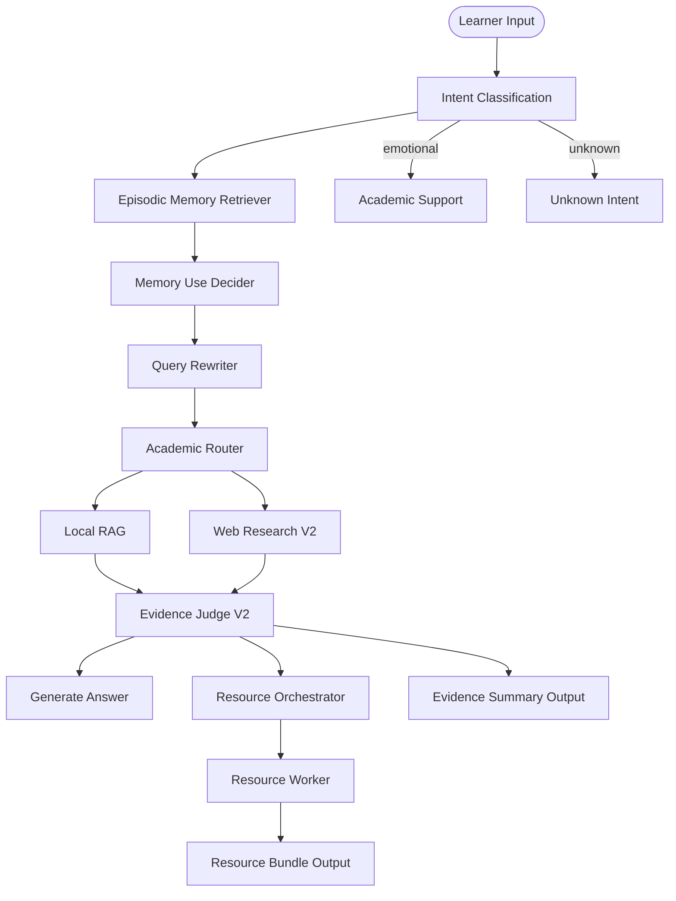

# A3 Study Agent

A3 Study Agent - AI-powered personalized learning resource generation assistant for university students.

<p align="center">
  <a href="README.md">中文 README</a> |
  <a href="docs/architecture/v0.3.0/diagram_design.md">Architecture Diagrams</a> |
  <a href="CHANGELOG.md">Changelog</a>
</p>

<p align="center">
  
  
  <a href="https://github.com/langchain-ai/langgraph">
    
  </a>
  <a href="./LICENSE">
    
  </a>
</p>

## About

A3 Study Agent is a multi-agent system for university learning scenarios. It helps learners generate personalized resources such as course Q&A, review documents, mind maps, quizzes, code practice, teaching scripts, teaching animations, and study plans.

The system combines local course-material RAG, BM25, reranking, Tavily Web Research, Evidence Judge V2, DeepSeek strict structured output, SSE streaming, and OpenTelemetry tracing. It is designed for diagnosable end-to-end learning workflows.

The external LangGraph/SSE node name `web_search` is kept for lifecycle compatibility, while the internal semantics are Web Research V2.

## Core Capabilities

- **Course Q&A**: Answer university course questions using local course materials and judged web evidence.
- **Personalized Resource Generation**: The unified resource path supports `review_doc`, `mindmap`, `quiz`, `code_practice`, `video_script`, `video_animation`, and `study_plan`.
- **Study Planning**: Generate Markdown / Word study plan documents through the unified resource path.
- **Academic Support**: Respond with the tone of a university learning mentor or academic support advisor.
- **Stable Structured Output**: Use DeepSeek official strict tool calling for small structured nodes and re-ask retry for recoverable compliance failures.
- **Observability**: Use A3_TRACE, OpenTelemetry, SSE node events, and structured diagnostics to inspect real interactions.
- **Configuration Driven**: Control behavior through YAML runtime settings and XML prompt templates.

## Architecture



See [`docs/architecture/v0.3.0/diagram_design.md`](docs/architecture/v0.3.0/diagram_design.md) for the complete diagrams.

## Tech Stack

| Layer | Components |
| ----- | ---------- |
| Frontend | Next.js 16, React, Tailwind CSS, React Flow |
| Backend API | FastAPI, Uvicorn, SSE |
| Orchestration | LangGraph |
| Local Knowledge | ChromaDB, BM25, reranker |
| Web Research | Tavily |
| Structured Output | DeepSeek official strict tool calling, Pydantic validation, re-ask retry |
| Evidence Judging | Evidence Judge V2 item grader + sufficiency judge |
| State Snapshots | LangGraph Checkpointer, MemorySaver by default, optional PostgreSQL |
| Observability | A3_TRACE, OpenTelemetry, Jaeger, SQLite fallback |
| Configuration | YAML settings, XML prompts |

## Quick Start

### Docker Compose

```bash
git clone https://github.com/kyle-1227/A3_study_agent.git
cd A3_study_agent

cp .env.example .env
# Edit .env and fill in model, search, and observability settings.

docker compose up -d

# Optional: enable Jaeger tracing
docker compose --profile observability up -d
```

Frontend: `http://localhost:3000`
Backend API: `http://localhost:8000`
Jaeger: `http://localhost:16686`

### Local Development

```bash
python -m venv .venv
.\.venv\Scripts\Activate.ps1

python -m pip install --upgrade pip
pip install -r requirements.txt
pip install -e .

cp .env.example .env
# Fill in API keys.
```

#### Build the Knowledge Base

Place PDF / MD / TXT course materials under one or more subject directories:

- `data/big_data`
- `data/computer`
- `data/machine_learning`
- `data/math`
- `data/python`

Then run:

```bash
python scripts/build_index.py
```

#### Run

```bash
# Terminal 1: backend
uvicorn app:app --reload --port 8000

# Terminal 2: frontend
cd frontend
npm install
npm run dev
```

## Project Structure

```text
A3_study_agent/
|-- app.py                         # FastAPI SSE endpoints + lifespan
|-- docker-compose.yml             # Backend + PostgreSQL + Jaeger
|-- config/
|   |-- settings.yaml              # Runtime parameters
|   `-- prompts/                   # XML prompt templates
|-- src/
|   |-- graph/                     # LangGraph nodes and state flow
|   |-- rag/                       # Local retrieval and indexing
|   |-- llm/                       # LLM factory and structured output runtime
|   |-- database/                  # Checkpointer management
|   |-- tracing/                   # OpenTelemetry setup
|   `-- tools/                     # Web research and resource tools
|-- frontend/                      # Next.js UI
|-- data/                          # University course materials
|-- scripts/                       # Indexing and debug scripts
`-- tests/                         # Test suite
```

## Testing

```bash
python -m pytest tests/test_config.py tests/test_app.py tests/test_rag.py tests/test_tracing.py -v

# If the environment allows:
python -m pytest -q
cd frontend && npm run build
```

## License

[MIT](./LICENSE)
