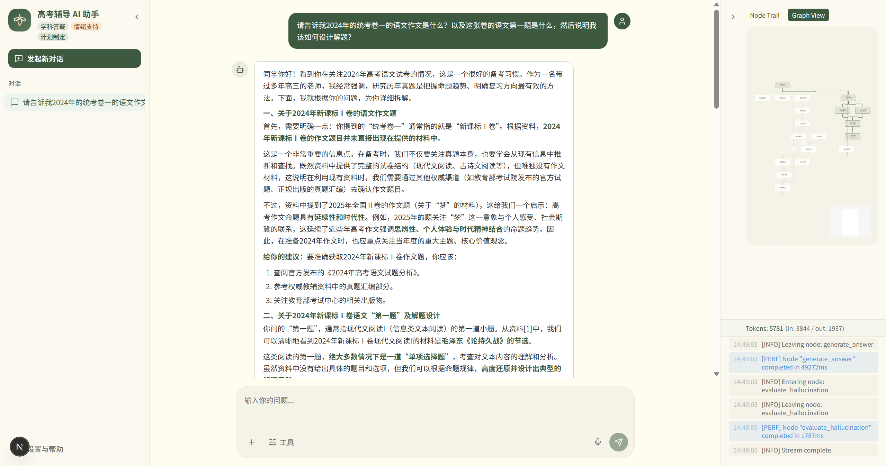
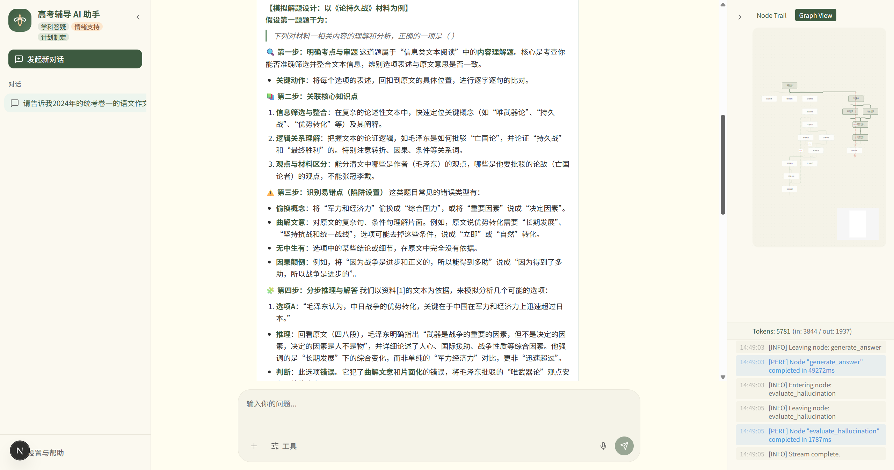
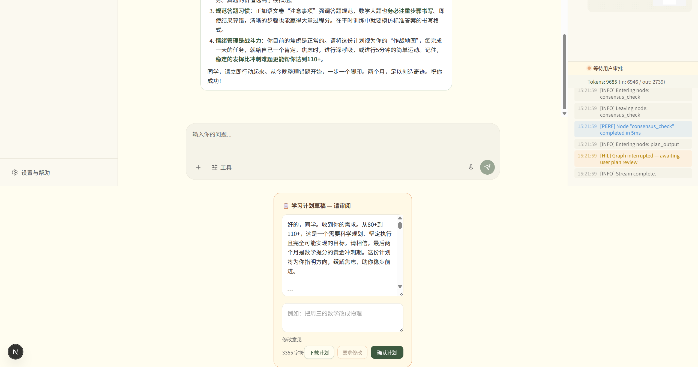
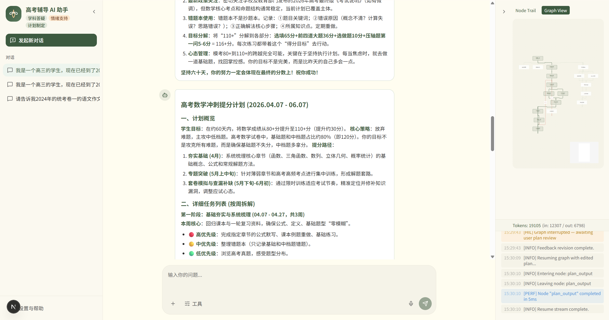
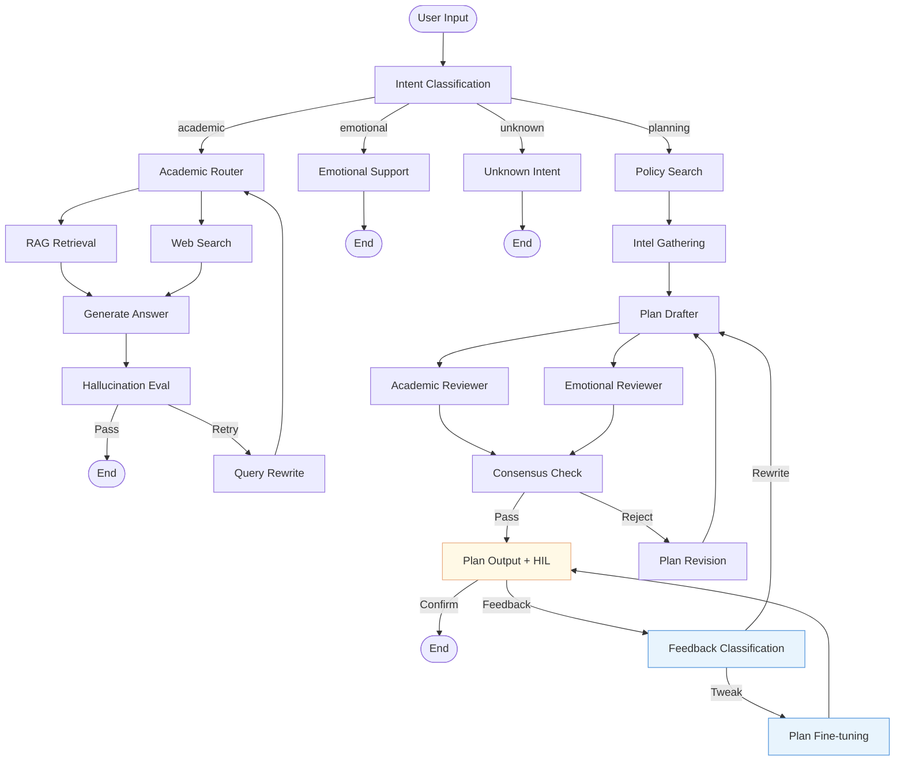

# Gaokao Tutor

<p align="center">
  <a href="README.md">中文文档</a> ·
  <a href="docs/architecture/v0.3.0/diagram_design.md">Architecture Diagrams</a> ·
  <a href="CHANGELOG.md">Changelog</a>
</p>
<p align="center">
  
  
  <a href="https://github.com/langchain-ai/langgraph">
    
  </a>
  <a href="https://github.com/chipfighter/gaokao_tutor/actions">
    
  </a>
  <a href="./LICENSE">
    
  </a>
</p>
<p align="center">
    <a href="##快速启动"><strong>Quick Start</strong></a>
    |
    <a href="##系统架构"><strong>Architecture</strong></a>
</p>

## About Project

A production-oriented, multi-agent conversational AI for Chinese Gaokao preparation. Built on **LangGraph** (stateful orchestration), **FastAPI** (SSE streaming), and **Next.js** (reactive frontend). A lightweight Qwen2.5-7B supervisor routes queries to three specialized agents — subject tutor, study planner, and emotional support — each backed by a fully observable, fault-tolerant pipeline.

---

## Project Purpose

This project is primarily intended as an **exploratory attempt at multi-agent scenarios within the education sector**, while also serving as a **deep dive into the practical application of the LangGraph underlying framework**.

> > Code maintenance and iterative exploration of the technology stack will be conducted **periodically during spare time**.

---

## Demo

> The React frontend provided in this project is positioned as a **lightweight reference implementation**. Its main purpose is to intuitively demonstrate complex Agent interactions (the core focus of the project), and is therefore relatively simple in design.

#### RAG + Search（Fan-out/Fan-in）

  

  

#### HIL Interrupt + System Change（give a new plan）





---

## What's New in v0.3.0

- **Adversarial Plan Generation**: Multi-agent review loop — Drafter generates a study plan, Academic Reviewer and Emotional Reviewer evaluate it in parallel, unanimous approval required or the draft is revised
- **Human-in-the-Loop (HIL) Plan Review**: Graph suspends via LangGraph `interrupt`, user can edit the plan directly or provide natural language feedback
- **Feedback Router**: Classifies user feedback as "tweak" (surgical edit, fast) or "rewrite" (clean slate with full adversarial loop)
- **Single Summary Anti-Bloat**: Only one compressed summary of all prior feedback rounds, preventing unbounded context growth
- **Interactive DAG View**: React Flow replaces static SVG — drag to pan, scroll to zoom, live status across 19 nodes
- **Plan Export**: One-click Markdown download of the study plan
- **`text` SSE Event**: Complete output from non-streaming nodes (plan output, unknown handler)
- **`done` SSE Event**: Stream completion marker for reliable frontend state management
- **Input Validation**: Pydantic `max_length` guards against oversized payloads

---

## Core Features

- **Academic Q&A** — Hybrid RAG (vector + BM25 + reranker) with parallel fan-out/fan-in, hallucination evaluation and automatic retry loop
- **Study Planner** — Adversarial multi-agent drafting + review loop, enriched with live Gaokao policy data, iterative human feedback
- **Emotional Support** — Warm, practical responses in the persona of an experienced homeroom teacher
- **Intent Routing** — Lightweight Qwen2.5-7B supervisor for low-latency intent classification
- **LLM Fallback** — Automatic failover to SiliconFlow (Qwen2.5-7B) when primary DeepSeek API is unavailable
- **Distributed Tracing** — OpenTelemetry across all graph nodes, exported to Jaeger (OTLP) with SQLite fallback
- **State Persistence** — PostgreSQL-backed LangGraph checkpointer for multi-turn memory + HIL interrupt/resume
- **Configuration-Driven** — YAML runtime parameters + XML prompt registry
- **Real-Time Observability** — SSE-driven reasoning path (interactive DAG or node trail), per-node timing, token usage
- **Markdown Rendering** — Full GFM support: tables, code blocks, LaTeX math, lists

---

## Architecture



Cross-cutting: `@traced_node` on every node → OpenTelemetry → Jaeger UI / SQLite.

See [`docs/architecture/v0.3.0/diagram_design.md`](docs/architecture/v0.3.0/diagram_design.md) for detailed Mermaid diagrams.

---

## Tech Stack

| Layer | Component | Detail |
| ----- | --------- | ------ |
| Frontend | Next.js 16 + Tailwind CSS 4 + React Flow | Reactive chat UI, SSE consumer, interactive DAG, Markdown renderer |
| Backend API | FastAPI + Uvicorn | SSE endpoints (`/stream`, `/resume`), CORS, OTel auto-instrumentation |
| Orchestration | LangGraph | StateGraph + `interrupt()` HIL + conditional edges + fan-out/fan-in |
| Routing LLM | Qwen2.5-7B (SiliconFlow) | Lightweight intent classifier + feedback router (temperature=0.0) |
| Generation LLM | DeepSeek-V3 | Academic answers, study plans, emotional support |
| LLM Fallback | Qwen2.5-7B (SiliconFlow) | Cross-provider failover on timeout / 5xx |
| Vector Store | ChromaDB | Local knowledge retrieval with L2→relevance normalization |
| Embedding | BAAI/bge-m3 (SiliconFlow) | Text vectorization for RAG |
| Keyword Search | rank-bm25 + jieba | Chinese-aware BM25 retrieval |
| Reranker | BAAI/bge-reranker-v2-m3 (SiliconFlow) | Cross-encoder reranking of merged candidates |
| Web Search | DuckDuckGo | Online retrieval for planner and academic fallback |
| State Persistence | PostgreSQL (psycopg) | Multi-turn memory + HIL interrupt/resume via LangGraph checkpointer |
| Observability | OpenTelemetry + Jaeger + SQLite | Distributed tracing across all graph nodes |
| Configuration | YAML + XML | Runtime settings and prompt templates |

---

## Quick Start

### Option A: Docker Compose (Recommended)

```bash
git clone https://github.com/chipfighter/gaokao_tutor.git
cd gaokao_tutor

cp .env.example .env
# Edit .env — fill in DEEPSEEK_API_KEY and SILICONFLOW_API_KEY

# Start (backend + frontend + PostgreSQL)
docker compose up -d

# Optional: enable Jaeger tracing
docker compose --profile observability up -d
```

Frontend: `http://localhost:3000` · Backend API: `http://localhost:8000` · Jaeger: `http://localhost:16686`

### Option B: Local Development

#### Prerequisites

- Python 3.11+
- Node.js 18+ and npm
- PostgreSQL (optional — state persistence + HIL; system runs stateless without it)

#### Backend

```bash
conda create -n gaokao_tutor python=3.11 -y
conda activate gaokao_tutor

pip install -e ".[dev]"

cp .env.example .env
# Fill in API keys
```

#### Build Knowledge Base

Place exam paper `.txt` / `.pdf` files under `data/chinese/` or `data/math/`, then:

```bash
python scripts/build_index.py
```

#### Frontend

```bash
cd frontend
npm install
```

#### Run

```bash
# Terminal 1 — Backend
uvicorn app:app --reload --port 8000

# Terminal 2 — Frontend
cd frontend
npm run dev
```

---

## Project Structure

```text
gaokao_tutor/
├── app.py                        # FastAPI SSE endpoints + lifespan
├── dockerfile                    # Multi-stage build (frontend + backend)
├── docker-compose.yml            # One-command deploy (backend + PostgreSQL + Jaeger)
├── config/
│   ├── settings.yaml             # Runtime parameters (temperatures, timeouts, retry limits)
│   └── prompts/                  # XML prompt templates
├── src/
│   ├── graph/
│   │   ├── builder.py            # Graph construction and compilation (19 nodes)
│   │   ├── state.py              # TutorState TypedDict (26 fields)
│   │   ├── supervisor.py         # Intent routing + keypoint extraction (Qwen2.5-7B)
│   │   ├── academic.py           # Parallel retrieval, answer generation, hallucination eval
│   │   ├── planner.py            # Policy search + intelligence gathering
│   │   ├── plan_adversarial.py   # Adversarial drafting/review + HIL feedback router
│   │   ├── emotional.py          # Emotional support
│   │   └── llm.py                # Centralized LLM factory + failover
│   ├── rag/                      # Hybrid retrieval: vector + BM25 + reranker
│   ├── config/                   # YAML settings loader + XML prompt cache
│   ├── database/                 # PostgreSQL checkpointer lifecycle
│   ├── tracing/                  # OTel setup, @traced_node decorator, SQLite exporter
│   └── schemas.py                # Pydantic request models
├── frontend/
│   ├── app/page.tsx              # Main page: SSE consumer, HIL feedback
│   └── components/
│       ├── chat-area.tsx         # Message bubbles with Markdown rendering
│       ├── plan-review.tsx       # HIL plan review component (edit/feedback/export)
│       ├── right-panel.tsx       # Interactive DAG + node trail + logs
│       └── left-sidebar.tsx      # Chat history
├── data/                         # Exam papers (Chinese, Math)
├── scripts/                      # Index building script
└── tests/                        # Test suite (fully mocked)
```

---

## SSE Event Protocol

| Event | Description | Example Payload |
| ----- | ----------- | --------------- |
| `thread_id` | Session ID (stream start) | `{"type":"thread_id","thread_id":"abc..."}` |
| `node_event` | Node lifecycle | `{"type":"node_event","node":"drafter","status":"start"}` |
| `token` | Streaming token | `{"type":"token","content":"..."}` |
| `text` | Non-streaming node output | `{"type":"text","content":"...","node":"plan_output"}` |
| `usage` | Token usage | `{"type":"usage","node":"drafter","input_tokens":500}` |
| `interrupt` | HIL interrupt | `{"type":"interrupt","draft":"...","thread_id":"..."}` |
| `done` | Stream complete | `{"type":"done"}` |
| `error` | Error | `{"type":"error","message":"..."}` |

---

## Testing

```bash
# Unit tests (no live API required)
OTEL_TRACING_ENABLED=false python -m pytest tests/ --ignore=tests/test_integration.py -v --tb=short

# Frontend build check
cd frontend && npm run build
```

---

## License

[MIT](./LICENSE)
