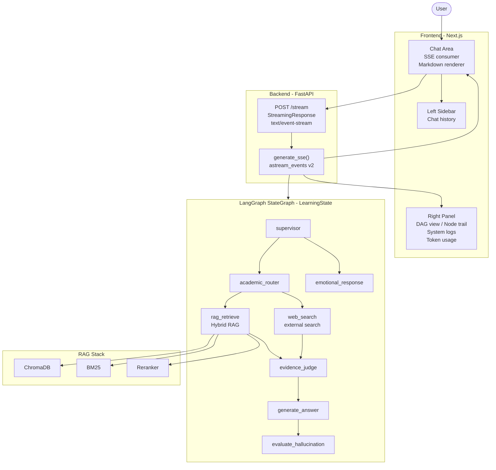
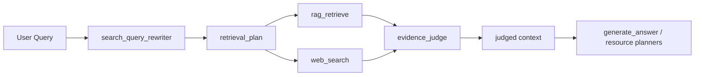
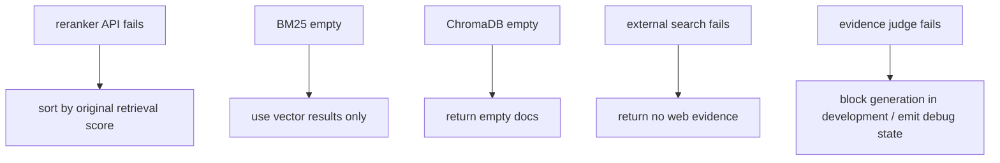
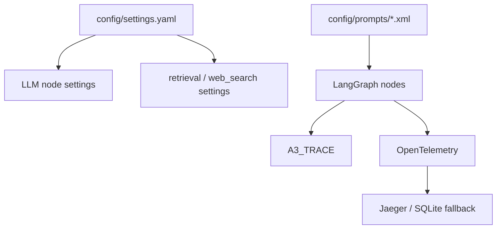

# v0.2.0 架构图

本文档是 v0.2.0 的历史架构参考。Mermaid 节点名尽量保留当时的代码命名，便于和历史提交、旧测试和调试记录对应。

> 当前实现已经演进到 v0.3.0：Web Search 周边逻辑已升级为 Web Research V2，Evidence Judge 也已升级为 V2。最新图示请查看 [`../v0.3.0/diagram_design.md`](../v0.3.0/diagram_design.md)。

---

## 1. 全系统架构总览

## 2. LearningState 写入归属

| 字段 | 主要写入节点 | 主要消费节点 |
| ---- | ------------ | ------------ |
| `messages` | `supervisor`、生成节点、支持节点 | 所有对话相关节点 |
| `subject` | `supervisor`、`search_query_rewriter` | `academic_router`、`rag_retrieve` |
| `retrieval_plan` | `search_query_rewriter` | `rag_retrieve`、`web_search` |
| `context` | `evidence_judge` | `generate_answer`、资源 planner |
| `evidence_judge_output` | `evidence_judge` | 生成节点、调试日志 |
| `requested_resource_type` | `supervisor` | `route_after_evidence_judge` |
| `review_doc_artifact` | `review_doc_output` | SSE artifact payload |

## 3. 检索与证据流程

v0.2.0 的重点是把本地 RAG 与外部搜索结果统一交给 Evidence Judge，再由 Evidence Judge 决定哪些证据进入生成上下文。

## 4. 降级与失败处理

历史版本里部分链路允许降级；当前 v0.3.0 对关键 Evidence Judge / structured output 失败更偏向 fail-fast，以便在开发阶段暴露问题。

## 5. 配置与观测

关键配置：

- `academic.*`：生成、重试和评估相关配置。
- `llm.*`：各节点使用的 provider、model、base URL 和 token budget。
- `llm_outputs.*`：结构化输出模式、fallback mode、retry 和 re-ask 配置。
- `retrieval.*`：RAG、Web Research、Evidence Judge 和证据上下文策略。

## 6. SSE 事件

| SSE 类型 | 用途 |
| -------- | ---- |
| `node_event` | 前端节点轨迹、运行状态和错误展示 |
| `text` | 生成中的回答文本 |
| `usage` | token 使用量 |
| `resource_status` | 练习、导图、复习文档等资源生成进度 |
| `review_doc_result` | 复习文档 artifact 下载信息 |
| `done` | 正常流结束 |

外部节点名 `web_search` 在 SSE 中保持稳定，避免破坏前端生命周期事件；内部实现可以升级为 Web Research V2。
