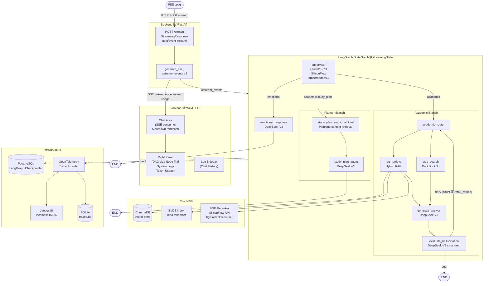
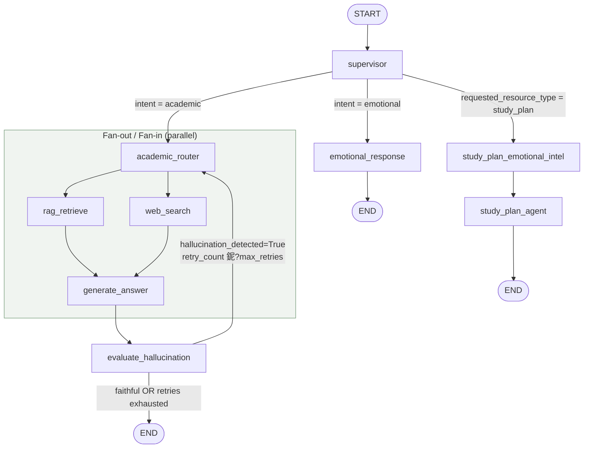
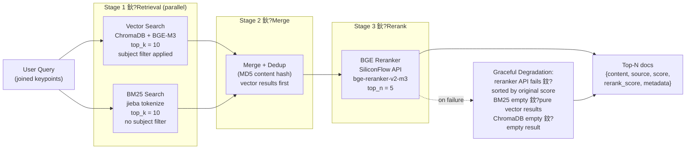
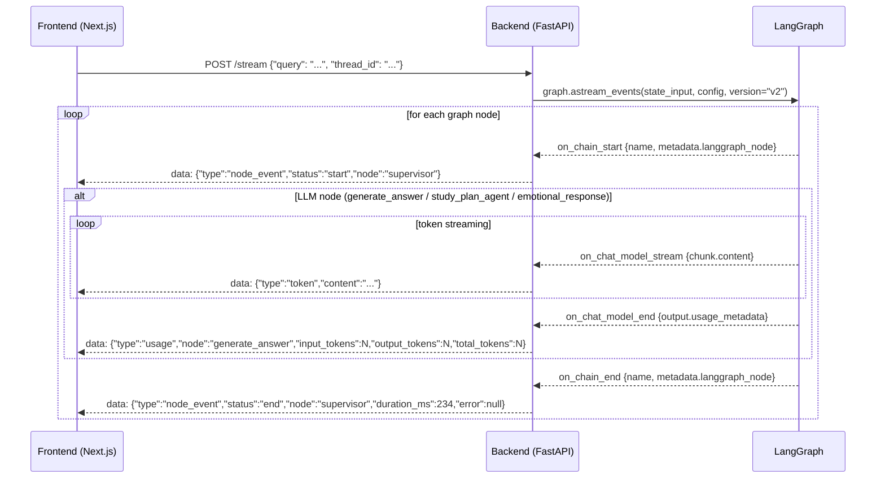
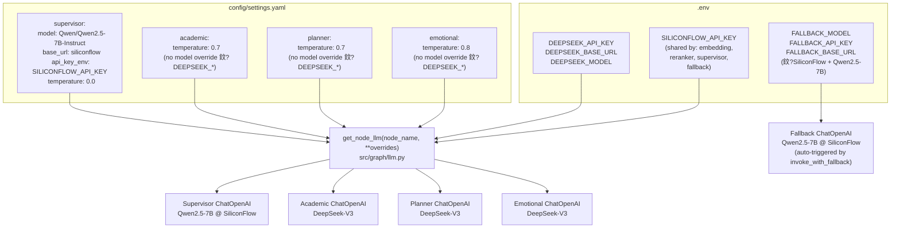

# v0.2.0 鏋舵瀯鍥?

鏈枃妗ｅ寘鍚?v0.2.0 绯荤粺鏋舵瀯鐨?Mermaid 鍥捐В銆侻ermaid 鑺傜偣鏍囩鍙婁唬鐮佺墖娈典繚鐣欒嫳鏂囷紝浠ヤ究涓庝唬鐮佸簱淇濇寔涓€鑷淬€?

---

## 1. 鍏ㄧ郴缁熸灦鏋勬€昏



---

## 2. LangGraph 鑺傜偣鎷撴墤锛堢姸鎬佹祦杞級



**`LearningState` 鍏抽敭瀛楁涓庡啓鍏ユ柟褰掑睘锛?*

| 瀛楁 | 鍐欏叆鏂?| 娑堣垂鏂?|
|------|--------|--------|
| `messages` | supervisor锛堝垵濮嬪寲锛夈€乬enerate_answer銆乬enerate_plan銆乪motional_response | 鎵€鏈夎妭鐐?|
| `intent` | supervisor | builder锛堟潯浠惰竟锛?|
| `subject` | supervisor | rag_retrieve锛堝厓鏁版嵁杩囨护锛?|
| `keypoints` | supervisor | rag_retrieve锛堟煡璇㈡瀯閫狅級 |
| `context` | rag_retrieve銆亀eb_search锛堥€氳繃 `operator.add` 鍚堝苟锛?| generate_answer |
| `study_plan_artifact` | study_plan_emotional_intel | study_plan_agent |
| `retry_count` | evaluate_hallucination | should_retry_or_end |
| `hallucination_detected` | evaluate_hallucination | should_retry_or_end |

---

## 3. 娣峰悎 RAG 娴佹按绾?



**`config/settings.yaml` 閰嶇疆鍙傛暟璇存槑锛?*

```yaml
rag:
  vector_top_k: 10
  bm25_top_k: 10
  reranker_top_n: 5
  relevance_threshold: 0.3
  reranker_model: "BAAI/bge-reranker-v2-m3"
```

---

## 4. SSE 浜嬩欢娴佹牸寮忚鑼?



**鍓嶇 SSE 浜嬩欢娑堣垂鏄犲皠锛?*

| SSE 浜嬩欢 | 鍓嶇澶勭悊閫昏緫 |
|----------|------------|
| `node_event` start | `nodeEvents` 鐘舵€侊細杩藉姞 `{node, status: "running", ts}` |
| `node_event` end | `nodeEvents`锛氭爣璁?`status: "done"`锛岄檮鍔?`durationMs`锛涘悜鏃ュ織杩藉姞 `[PERF]` 鏉＄洰 |
| `node_event` end with error | `nodeEvents`锛氭爣璁板畬鎴愶紱鍚戞棩蹇楄拷鍔?`[ERROR]` 鏉＄洰 |
| `token` | 灏?`content` 杩藉姞鍒板綋鍓嶅姪鎵嬫秷鎭紙娴佸紡鎵撳瓧鏈烘晥鏋滐級 |
| `usage` | 绱姞鍒?`tokenUsage` 鐘舵€侊紱鍚戞棩蹇楄拷鍔?`[USAGE]` 鏉＄洰 |

---

## 5. LLM 閰嶇疆鏋舵瀯



