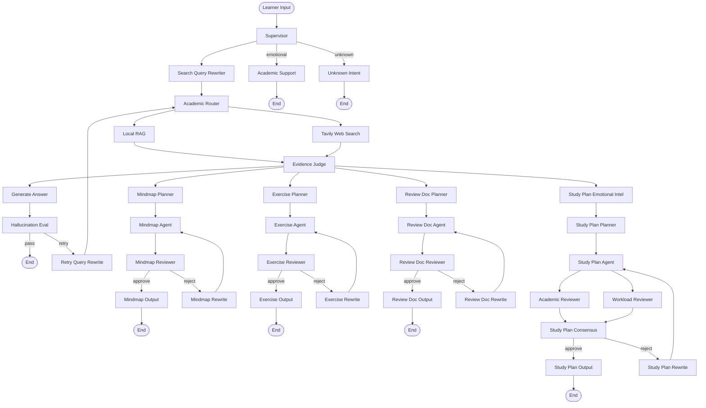

# v0.3.0 Architecture Diagram

## Runtime Graph

## Notes

- `rag_retrieve` and `web_search` are parallel evidence-source nodes.
- `evidence_judge` is a barrier fan-in node. It runs once after both evidence-source nodes finish.
- Resource generation nodes only run after Evidence Judge has assembled judged context.
- `study_plan` is a resource-generation sub-agent, not a standalone planning branch.
- Development mode is fail-fast: planner/agent/reviewer failures raise and stop the graph instead of producing fallback output.
