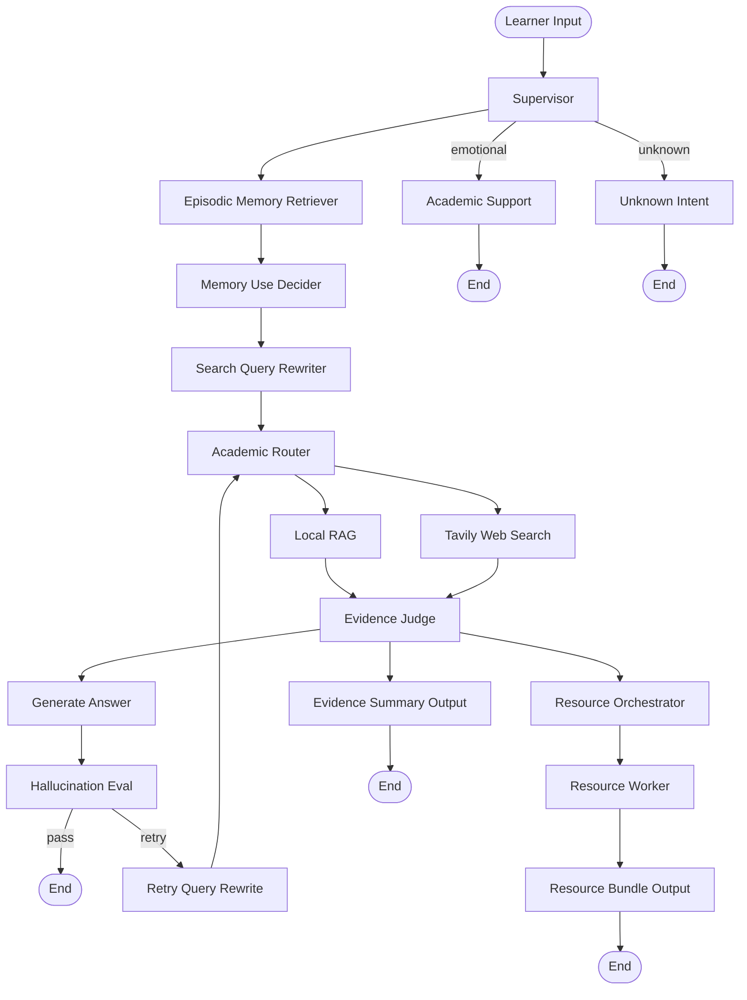

# v0.3.0 Architecture Diagram

## Runtime Graph

## Notes

- `episodic_memory_retriever` and `memory_use_decider` run before query rewriting so memory use is explicit.
- `rag_retrieve` and `web_search` are parallel evidence-source nodes.
- `evidence_judge` is a barrier fan-in node. It runs once after both evidence-source nodes finish.
- Resource generation only runs after Evidence Judge has assembled judged context.
- Single-resource and multi-resource requests both use `resource_orchestrator -> resource_worker -> resource_bundle_output`.
- Supported formal resource types are `review_doc`, `mindmap`, `quiz`, `code_practice`, `video_script`, `video_animation`, and `study_plan`.
- Development mode is fail-fast: planner/agent/reviewer failures raise and stop the graph instead of producing fallback output.
