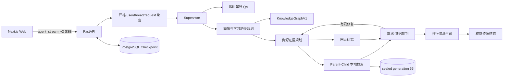

# A3 Study Agent 系统开发说明书

## 1. 文档范围

本文面向比赛评审、演示人员和工程维护者，说明需求到实现的映射、关键设计、开发与集成方式以及现实生产边界。比赛演示 runtime source / integration 为
`ca3960a`，已由 `main` 包含并发布；`707d79806364d95fd300b21d0cb93411f592d67a` 仅是两轮历史浏览器实测证据。SSE `eed2139`、Evidence `4a91f68` 与 RAG `f53a710` 已分别以 `d7f5802`、`cde3e59`、`fa0f2dc` 集成，最终 Docker 基础复验已完成。生产身份为 resource-aware PGR、`KnowledgeGraphV1`、知识图谱数据版本
`2026.07.15-source-groups-v1` 和密封 generation `pc_20260715_98336c2_55`。精确 manifest、KG artifact 与 Evidence fingerprint 分别为
`db579d40d1f4b79882f495277026e8fccfbfb816fbb150998e47753eec470218`、
`c504e41ef2e481b30b940ac6cb04f661401f7907d1690efeafc1ed14680fa0b5` 和
`9dec07d4f097bae80bbf815bd53494e4e8045b15e536d0fc38daa3b4da2e032b`。

## 2. 需求分析

目标用户是需要在课程资料、练习、复习和项目实践之间建立连续学习过程的高校学生。系统针对四类主要问题：

1. 资料数量多但与当前基础、目标和进度不匹配；
2. 一次性回答缺少持续画像、学习路径和后续评估；
3. 多模态资源生成时间长，用户缺少进度和故障反馈；
4. 大模型可能产生无来源内容，教育场景需要证据、校验和可追溯身份。

本项目把“个性化”定义为可审计的数据流：对话证据更新画像，画像与历史/assessment 进入路径规划，路径映射到知识图谱 topic，证据编排为每类资源收集并裁判依据，最终生成的资源保留线程、请求、学科、topic 和 artifact 身份。它不是仅在提示词中插入学生姓名。

非目标包括：替代教师作高风险教育决策、保证生成内容零错误、在没有授权资料和密封索引时自动降级运行，以及未经额外安全建设直接服务公网多租户。

## 3. 总体架构

主要技术栈是 Python 3.11+、FastAPI、LangGraph/LangChain、Pydantic、PostgreSQL、Chroma/BM25/RRF/reranker、Next.js/React 和 Docker Compose。API 与 SSE 入口在 [app.py](../../app.py)，严格 RAG 身份在
[config/rag/index.production.yaml](../../config/rag/index.production.yaml)，部署拓扑在
[docker-compose.yml](../../docker-compose.yml)。

“多智能体”在这里指具有独立输入/输出合同、职责和失败语义的图角色，不虚构为多个独立服务器或多个 Provider 账号。统一图状态让角色之间能传递受验证的数据，而不是互相传递任意自由文本。

## 4. 动态学习者画像

[画像模型](../../src/profile/schema.py)提供不少于六个可持续更新的维度；[对话抽取器](../../src/profile/extractor.py)只抽取对话中有证据的信号，并经结构化输出和范围校验后合并。

| 维度 | 数据与用途 | 动态性 |
| --- | --- | --- |
| 技能/知识基础 | 按技能保存 0–1 水平、置信度、证据次数和最近观察 | 新对话、测验和观察可增量更新 |
| 学习风格 | 示例、视觉、分步、简洁、理论、实践、类比等连续偏好 | 仅对观察到的信号调整 |
| 学习目标 | 目标、重要度、进度和创建时间 | 支持新增、排序和进度更新 |
| 学习行为 | 会话时长、活跃、测验准确率、提问和追问等聚合信号 | 随行为和 assessment 演进 |
| 智能体观察 | 内容、类别、重要度、证据和时间 | 保留画像结论的来源 |
| 不喜欢/回避内容 | 无效主题和表达方式 denylist | 对话反馈可增量维护 |
| 标签与扩展字段 | 可审计的扩展信息 | 为新课程和新维度预留 |

画像摘要只选择高置信、高相关信号进入下游提示，不把完整个人数据无边界传播。当前可信本地演示仍需在公网化前补齐数据保留期限、用户删除权、租户隔离和隐私告知。

## 5. 多智能体职责

| 角色 | 主要职责 | 失败语义 |
| --- | --- | --- |
| Supervisor | 识别 QA 或资源请求，编排单/多学科、多资源工作 | 路由或合同不合法时显式失败 |
| Profile / history | 读取严格绑定的画像、历史和 assessment | 不使用其他用户或线程状态 |
| Learner path planner | 将目标、进度和画像映射到 source-backed KG topic 和顺序 | topic 身份不匹配时拒绝 |
| Resource evidence planner | 为资源类型生成证据需求和检索计划 | 初始轮后最多 3 轮补搜，总任务 24、ledger 72 |
| Local retrieval | Vector + BM25 + RRF + reranker + parent hydration | generation/manifest/阶段失败即停止 |
| Web research | 对允许的网页来源补充证据 | 网络或安全校验失败不伪造成成功 |
| Requirement evidence judge | 逐项判断证据充分性并触发有限次数修复 | required evidence 不完整或超出预算后给出 blocked 终态 |
| Resource generators | 按资源合同并行生成并保存 artifact | 不完整资源不发布下载；partial 不转为成功 |
| QA tutor | 提供即时文字辅导并保持线程状态 | 与资源终态、用户身份严格区分 |

`code_practice` 生成节点使用流式配置；严格 `code_practice_reviewer` 使用独立 non-streaming 配置。reviewer 的 Pydantic 合同和业务验证不可由文本生成成功替代。

[网页研究实现](../../src/graph/web_research.py)和[证据编排实现](../../src/graph/evidence.py)体现了来源、需求、裁判和修复边界。

## 6. 七类个性化资源

| 资源类型 | 学习价值 | 主要输出 |
| --- | --- | --- |
| Study plan | 把目标拆成有顺序的阶段和任务 | 学习计划 |
| Mind map | 展示知识点层级和关系 | 可视化思维导图 |
| Quiz | 练习、即时检查和效果评估 | 多类型题目与答案/解析 |
| Review document | 形成可复习、可下载的课程材料 | 复习文档 |
| Code practice | 提供可执行思路、任务和验证要求 | 代码实操案例 |
| Video script | 把知识点组织为多模态讲解脚本 | 分镜/讲解脚本 |
| Video animation | 将脚本渲染为可播放资源 | 视频动画 artifact |

七类资源共享画像、路径、证据和身份合同，但使用资源专属的证据 profile 和业务验证。代码练习等高风险输出不能仅以“LLM 返回了文本”作为成功条件。

## 7. 路径、推荐、辅导与评估闭环

路径规划先根据学习目标、已有技能、学习历史和 assessment 确定课程 topic 及先后关系，再从已生成或可生成资源中选择适配类型。推荐不是独立的热度排序，而是受 KG topic、资源证据和画像约束。

即时 QA 为学习中的问题提供辅导；Quiz 和 assessment 记录为效果观察提供输入；学习历史、行为和对话观察再更新画像并影响下一次路径和资源计划。当前实现提供工程闭环，但“提升学习效果”仍需受控用户研究、人工评分与长期数据验证，不能由单元测试推导。

## 8. 防幻觉、内容安全与失败闭合

- topic 和本地资料必须绑定 `KnowledgeGraphV1` 及 source identity。
- 本地与网页证据按资源需求分项收集，裁判不通过时只在同一 PGR 路径内进行有界补搜；最多 3 个补充轮次、24 个 search task、72 条 ledger entry，且 required evidence 完整性门槛不降低。
- LLM 结构化输出经 Pydantic 与业务校验；不通过时不会通过别名归一化或默认值伪造合法结果。
- 请求过程中不自动切换 Provider、模型、Flat RAG 或其他检索实现。
- Evidence `4a91f68` 的 bounded reask 只重问失败的 resource+subject partition，保持同一 Provider/模型并重走完整结构化、业务、预算与身份校验；它不自行判断 blocked。
- RAG `f53a710` 只在同一 rerank endpoint 拆分批次，并要求每个候选都有完整 score；RRF-only、partial scores、协议漂移或身份错误均失败。
- SSE `eed2139` 只在 transport 或 HTTP 410 后执行一次同用户/线程/请求的权威 status recovery，不重提请求；pending、legacy、sequence gap、identity drift 和合同错误显式失败。
- generation、registry primary、manifest、KG 和 evidence orchestration 身份任一不一致都会阻止 readiness。
- 日志、SSE、报告和截图不得暴露 API key、Authorization、完整数据库 URI 或 Provider body。
- 资源 blocked 是合法、可见的严格终态；前端不得为 blocked 资源生成虚假下载卡。

这些措施降低幻觉和敏感信息风险，但无法证明所有学术内容均无事实错误。比赛演示和真实发布仍需抽样核验引用、题目答案、代码可运行性和视频表达。

## 9. 流式体验、恢复与可观测性

核心交互通过 `agent_stream_v2` SSE 提供事件序号、`EvidenceProgress`、资源状态、权威终态和 `stream_done`。Last-Event-ID 支持保留窗口内的增量回放，thread status 用于刷新恢复；PostgreSQL checkpoint 保留跨进程状态。`AsyncPostgresSaver` 由严格配置、借出前健康检查的重连连接池提供，数据库连接失效不会触发 `MemorySaver` 降级；启动或重连失败仍显式失败。前端以 Markdown、进度和资源卡片展示长任务，避免长时间白屏。

生产验收必须同时检查连续序号、唯一权威终态、终态与 status 一致、刷新恢复、请求漂移冲突和下载 artifact 身份，不能只看页面“有内容”。PostgreSQL-only restart 还必须保持 backend/frontend 容器身份不变，并复核重启前的历史线程；readiness 恢复不能替代状态恢复证据。

## 10. 开发、集成与优化

仓库采用严格配置、结构化合同、聚焦测试和静态门禁。Provider、模型、base URL、API-key 环境变量名和 retry 策略来自配置；业务节点不硬编码。P0、PG、PR、PGR 仅用于离线消融评估：PGR 是唯一 served path，其他变体不能被描述为生产灰度或 fallback。有界 Evidence 补搜是同一路径内的质量修复，不是 Provider、模型、generation 或 RAG 降级。

性能优化主要来自并行资源编排、分阶段进度、父文档 hydration、持久化状态和可恢复 SSE，而不是隐藏超时。多模态任务可用更长时间完成，但必须持续给出可验证状态。

详细的本地命令见根 [README](../../README.md)，测试见[测试说明书](test_report.md)，部署见[部署说明书](deployment_guide.md)。

## 11. 现实生产评估

当前实现适合作为功能完整、严格失败、可恢复的可信本地比赛演示；以下条件未闭合前不应表述为公共 SaaS 生产就绪：

- Docker/Provider/浏览器链路已连续完成两轮 code-practice，完整六场景、最终 PostgreSQL 重启回归和人工内容验收仍未闭合；
- 多租户身份认证、租户隔离、滥用/速率控制和正式告警值守未形成完整证据；
- 干净 checkout 不包含获授权课程资料和密封索引；
- PyMuPDF、课程资料、模型服务及网页来源的许可/条款需要人工批准；
- 六场景 smoke authoring 不是正式 Gold 或教育效果基准。

## 12. AI 辅助开发披露

可审计开发记录显示使用了 OpenAI Codex 进行代码审阅、实现和文档辅助。AI 产出仍由开发者通过 diff、测试和人工审阅负责。当前仓库没有足够证据证明使用过科大讯飞 AI Coding 工具；鉴于赛题实现条件中的相关要求，参赛负责人必须在提交前向组委会确认并提供真实证据，不得补写虚构经历。
